# Abuse-Ring Sentinel

**Track:** AI Risk Manager — Razorpay AI Buildathon
**Category:** Abuse-ring sentinel (coordinated multi-account fraud detection)

Detects coordinated multi-account abuse — groups of "different" accounts that are
secretly the same person or group, working together to abuse promos, returns, or
referral bonuses — which row-by-row fraud classifiers structurally cannot see,
because no single transaction in the group looks wrong on its own.

---

## The problem

Merchants lose money not just to lone bad actors, but to **coordinated** abuse:
multiple accounts working together, each looking individually clean, but
collectively draining money through referral fraud, return abuse, or promo abuse.

The fraud signal isn't in any one account — it's in the **relationship between
accounts**: accounts that quietly share a device, payment card, delivery address,
or IP, and act in coordinated bursts. A classifier that scores one transaction at
a time is structurally blind to this.

## Our approach

1. **Model accounts as a graph.** Draw an edge between two accounts whenever they
   share a device, card, address, or IP.
2. **Extract cluster-level features.** How big is this connected cluster? How
   densely linked? How many *different kinds* of things do they share (device
   only, or device *and* card *and* address)? How tightly clustered in time were
   their signups and transactions?
3. **Classify clusters, not accounts in isolation**, using an XGBoost model
   trained on these graph + timing features.
4. **Evaluate on entirely unseen rings** — the test set is split by whole ring,
   never by row, so no ring the model is scored on was ever seen during training.
5. **Explain every flag.** Every flagged account gets a structured audit record
   and a plain-English explanation — never an unexplained verdict.
6. **Strictly defense-only.** The system only ever recommends `FLAGGED_FOR_REVIEW`.
   It never blocks, freezes, or takes automated action on any account.

## Who this is for

A **merchant's risk/fraud analyst** — someone who currently has to manually dig
through connected accounts to spot coordinated abuse. This dashboard gives them a
ranked queue of suspicious clusters, the graph evidence, and a plain-English
explanation, so they can review in seconds instead of hours. The decision to act
always stays human.

## Architecture

```mermaid
flowchart LR
    A[Accounts + Transactions] --> B[Graph Builder]
    B -->|shared device/card/address/IP| C[Connected Components]
    C --> D[Feature Extraction]
    D -->|component size, density,<br/>attr types, timing spread| E[XGBoost Classifier]
    E -->|ring probability| F[Explainability Layer]
    F -->|structured audit record +<br/>plain-English explanation| G[Streamlit Dashboard]
    G --> H[Human Risk Analyst]
    H -->|reviews, decides| I[Escalate / Dismiss]
```



**Pipeline (scripts, run in order):**
```
src/generate_data.py   → synthetic accounts, transactions, planted rings, innocent noise
src/build_graph.py     → builds the account graph, extracts cluster features
src/train_model.py     → trains XGBoost, evaluates on held-out unseen rings
src/explain.py         → generates audit records + plain-English explanations
src/app.py             → Streamlit dashboard (the demo)
```

## Results (held-out test set — entirely unseen rings)

| Metric | Value |
|---|---|
| Precision | 98.0% |
| Recall | 99.0% |
| F1 | 98.5% |
| ROC-AUC | 0.999 |
| False positives | 2 (out of 972 non-ring accounts) |
| False negatives | 1 (out of 98 ring members) |

**Stress tests (deliberately hard cases, not just easy averages):**
- **Hard innocent clusters** (e.g. a family signing up together during a promo
  weekend — tight timing, but not fraud): **0 false positives** out of 25.
- **Evasive rings** (rings that deliberately spread transactions over weeks to
  evade timing-based detection): **100% recall** — caught all 17 in the test set.

**Estimated cost** (illustrative assumptions, stated explicitly in code):
$150 per false-positive investigation, $8,000 per missed ring → estimated total
cost on this test set: **$8,300**, dominated by the single missed ring rather than
false-positive investigation overhead.

## Honest limitations

- **All data is synthetic.** We don't have access to real Razorpay transaction
  data, so results are on a self-generated dataset, not real-world traffic.
- **The dominant signal (`n_high_conf_attr_types`) may be cleaner than reality.**
  Our model relies heavily on how many *distinct types* of resources (device,
  card, address) a cluster shares. This is a real, defensible fraud signal — but
  in our synthetic data it separates classes unusually cleanly. Real-world data
  would likely be messier, and we'd want to validate this specific signal against
  real data before trusting it at this confidence level.
- **Cost figures are illustrative**, not real merchant financials.
- **Single-merchant scope.** Real fraud rings sometimes operate across multiple
  merchants; this would require shared infrastructure to catch.
- **IP-sharing noise is modeled simply.** We simulate some innocent IP reuse
  (mobile carrier NAT, public WiFi), but real-world IP noise is more complex.

## Roadmap to production

1. **Validate on real (or realistic) data** — partner with an anonymized merchant
   dataset; add richer attributes (email similarity, browser fingerprint,
   behavioral biometrics).
2. **Feedback loop** — feed analyst confirm/dismiss decisions back into retraining;
   track model drift over time.
3. **Scale & speed** — incremental graph updates instead of full rebuilds; consider
   a graph database (e.g. Neo4j) at scale.
4. **Strengthen against adaptive fraud** — behavioral features that don't depend
   on timing; second-degree (friend-of-friend) connections; regular red-teaming.
5. **Privacy & compliance** — hash/tokenize all identifiers (already fingerprinted,
   not raw); design for India's DPDP Act and PCI-DSS.
6. **Integrate into Razorpay's existing merchant dashboard** — surface flags where
   analysts already work; expose as an API/webhook.

## Why this benefits Payment gateway providers

- **Direct merchant savings**: promo/referral/return-abuse rings directly drain
  merchant margins; catching them keeps more money with legitimate merchants.
- **Differentiation**: most fraud tooling scores transactions one at a time; a
  graph-based approach catches what row-level detection structurally cannot.
- **Responsible-AI story**: explainable, defense-only design means this could be
  deployed without the trust/legal risk of a fully automated system wrongly
  punishing real customers.

## Setup

```bash
pip install -r requirements.txt
python src/generate_data.py
python src/build_graph.py
python src/train_model.py
python src/explain.py
streamlit run src/app.py
```

## Repo structure

```
data/         synthetic data + model outputs (regenerated via scripts, not committed except audit_log.json)
src/          all pipeline code
notebooks/    exploration (if any)
docs/         detailed project explanation (docs/PROJECT_EXPLAINED.txt)
```
